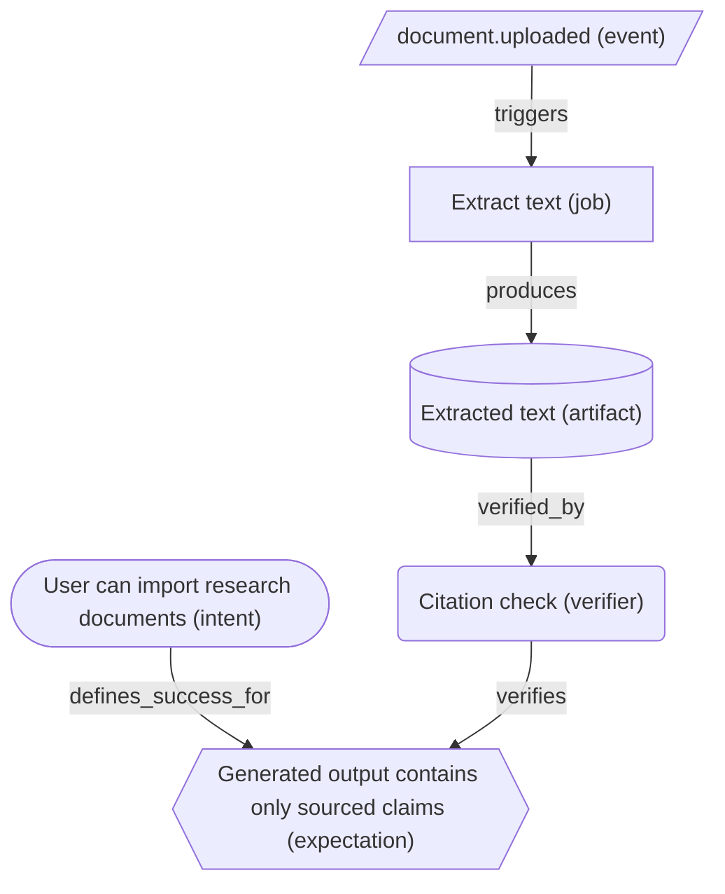

# specdag

A fast CLI and Model Context Protocol (MCP) server for validating, assembling, and analyzing dependency maps in Event-Spec-Driven Development (ESDD). Once installed, the Go binary runs fully offline.

## Approach: Event-Spec-Driven Development + DAGs

`specdag` is built around a simple idea:

> Intent and expectations define what should be true.  
> Events and contracts define how systems communicate.  
> A dependency DAG defines what depends on what, what is blocked, and what must be verified before work is considered safe.

This makes `specdag` a small control layer for Event-Spec-Driven Development (ESDD). It is not a runtime workflow engine and it is not a code knowledge graph. Instead, it validates declarative dependency maps that live next to feature specs.

A typical feature folder may contain:

```text
specs/features/012-agent-run/
  spec.md
  event-flow.md
  dependency-map.yaml
  contracts/
  evidence/
  tasks.md
```

The local `dependency-map.yaml` describes the feature’s intended dependency structure: intents, expectations, events, commands, jobs, artifacts, verifiers, approvals, and contracts.

Global maps are generated, not hand-authored:

```text
specs/features/*/dependency-map.yaml
        ↓
specdag assemble
        ↓
specs/_generated/dependency-map.global.json
```

Local maps are the editable source of truth. Global maps, Mermaid diagrams, HTML reports, and impact reports are generated review artifacts.

## How specdag fits with code knowledge graphs

`specdag` models the intended system behavior before or during implementation:

```text
specdag = desired architecture, feature intent, event contracts, dependency DAG
```

Code knowledge graph tools such as **GitNexus** can then be used to inspect the actual repository structure:

```text
GitNexus = actual code structure, files, symbols, call chains, code dependencies
```

The intended workflow is:

1. **Define** intent, expectations, events, and contracts.
2. **Add or update** `dependency-map.yaml` for Level 2/3 features.
3. **Validate** the map with `specdag`.
4. **Assemble** global dependency maps when multiple features interact.
5. **Use** a code knowledge graph tool such as GitNexus to locate the actual implementation points.
6. **Compare** the desired Spec-DAG with the actual code structure.
7. **Implement** changes.
8. **Re-run** `specdag` validation, tests, and review reports.

In short:
* `specdag` defines what **should** be true.
* `GitNexus` helps find where the code currently implements or violates it.

---

## Features

- **Deterministic Guardian:** Validates declarative feature maps for cyclic graphs, node types, and edge constraints.
- **Global Assembly:** Recursively merges decentralized, feature-local dependency maps, detects naming conflicts, and validates system-wide relations.
- **Impact Analysis:** Traverses downstream paths via Depth-First Search (DFS) to list downstream nodes reachable from a selected node.
- **Visualization:** Generates filterable Mermaid diagrams and static HTML review reports.
- **MCP Server:** Exposes tools for validating maps, assembling global graphs, rendering diagrams, showing summaries, performing impact analysis, and generating reports.

---

## Example Diagram

GitHub natively renders Mermaid code blocks. Below is how a typical feature dependency map is visualized:



---

## Installation

### A) Via npm/npx (Recommended for Cursor / Claude Desktop)

You do not need to install specdag globally. You can run it directly:

```bash
npx @japorto100/specdag --help
```

Or install it globally on your system:

```bash
npm install -g @japorto100/specdag
specdag --help
```

*Note: The installed Go binary runs fully offline. The initial npm/npx installation requires network access to download the appropriate precompiled native Go binary for your operating system (Linux, macOS, Windows) and CPU architecture (amd64, arm64) from GitHub Releases.*

### B) Via Go

If you have Go installed on your system:

```bash
go install github.com/japorto100/specdag@latest
```

---

## MCP Server Configuration

Add specdag to your MCP configuration file (e.g., `mcpServerConfig.json` for Cursor or Claude Desktop):

### A) Via npx (No Go installation required):

```json
{
  "mcpServers": {
    "specdag": {
      "command": "npx",
      "args": ["-y", "@japorto100/specdag", "mcp"]
    }
  }
}
```

### B) Via Go (If go install was used):

```json
{
  "mcpServers": {
    "specdag": {
      "command": "specdag",
      "args": ["mcp"]
    }
  }
}
```

---

## CLI Commands

### 1. Validate locally
Checks a local feature map file for syntactic and topological validity (cycle checking):
```bash
specdag validate specs/features/012-agent-run/dependency-map.yaml
```

### 2. Assemble globally
Recursively searches a directory for all local maps, validates them, and merges them conflict-free:
```bash
specdag assemble specs/features/ -o specs/_generated/dependency-map.global.json
```

### 3. Render Mermaid
Generates Mermaid markdown diagram code from a map. Use `--view` to filter specific sub-views (`full`, `critical-path`, `approvals`, `events`, `verification`, `orphans`):
```bash
specdag render specs/features/012-agent-run/dependency-map.yaml --view critical-path
```

### 4. Output Summary
Calculates KPIs, approval gates, orphan nodes, and the critical path:
```bash
specdag summary specs/features/012-agent-run/dependency-map.yaml
```

### 5. Perform Impact Analysis
Finds all transitively affected downstream system components when a node ID changes:
```bash
specdag impact specs/features/012-agent-run/dependency-map.yaml event.document.uploaded
```

### 6. Generate HTML Report
Generates a beautiful static HTML review page (KPIs, tables, Mermaid diagrams, filters) for a feature map or an assembled directory:
```bash
specdag report specs/features/ -o specs/_generated/dependency-report.html
```

---

## License

MIT License.
