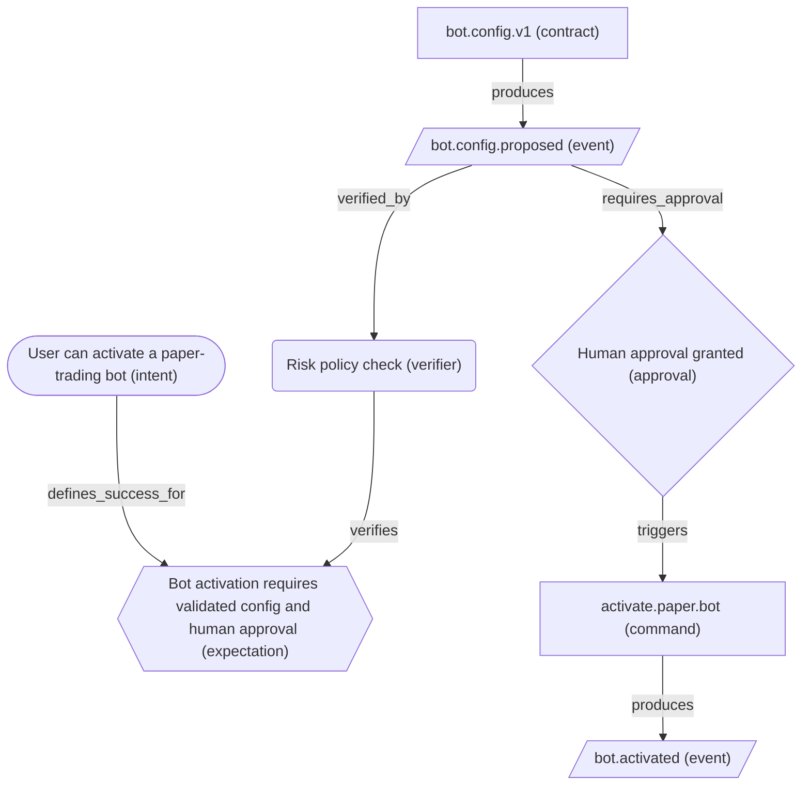
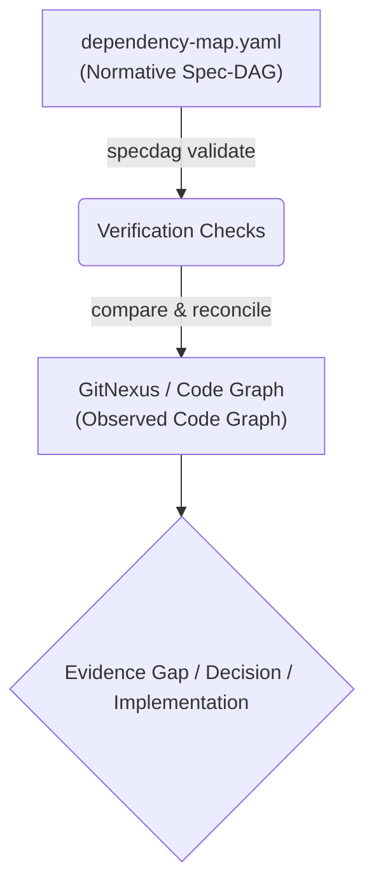

# specdag

A fast CLI and Model Context Protocol (MCP) server for validating, assembling, and analyzing dependency maps in Event-Spec-Driven Development (ESDD). Once installed, the Go binary runs fully offline.

---

## Approach: Normative Spec-DAG Grounded in Evidence

`specdag` is built around a clear distinction between intended behavior (normative) and observed reality (descriptive):

> **Intent and expectations** define what should be true.  
> **Events and contracts** define how systems communicate.  
> A **dependency DAG** defines what depends on what, what is blocked, and what must be verified.

This makes `specdag` a **normative control layer** for Event-Spec-Driven Development (ESDD). It does not reverse-engineer your code automatically, nor is it a runtime workflow engine. Instead, it models your **intended (desired) dependencies**, grounded in repository evidence.

### Three Layers of Truth

To avoid semantic drift and agent confusion, the ESDD workflow distinguishes between three states:

1. **Intended / Normative (What should be true):** Defined by feature intents, expectations, accepted contracts, and safety policies. This is modeled in `dependency-map.yaml`.
2. **Observed / Descriptive (What actually exists):** The current implementation, tests, log traces, and code graphs (observed via tools like **GitNexus** or `agent_run_trace`).
3. **Reconciled / Accepted (What we agree is the new truth):** Handled through `decisions.md` and durable schemas in `events/`, `contracts/`, or `domains/`.

### The Golden Rule of Spec-DAGs
> **Code may inform the Spec-DAG, but code does not automatically define the Spec-DAG.**  
> If the actual code structure and the Spec-DAG disagree, do not silently rewrite the map. Record the mismatch as an **Evidence Gap** or **Decision** so human owners can decide.

---

## Example: Bot Activation Spec-DAG

GitHub natively renders Mermaid code blocks. Below is how a normative feature dependency map for trading bot activation is modeled and visualized in `specdag` (focusing on obligations and gates, rather than simple data flow):



---

## How specdag fits with code knowledge graphs

`specdag` defines the intended architecture, while code intelligence engines like **GitNexus** analyze the actual codebase:

```text
specdag    = Normative Spec-DAG (desired architecture, event contracts)
GitNexus   = Observed Code Graph (actual files, symbols, call chains, dependencies)
Run Trace  = Observed Runtime Trace (what happened during execution)
```

### The ESDD Workflow



1. **Define** intent, expectations, events, and contracts in specs.
2. **Model** the intended dependencies in a local `dependency-map.yaml` next to feature specs.
3. **Ground** the map with explicit code/spec references (`node.ref`).
4. **Validate** the map using `specdag validate`.
5. **Assemble** local maps into a global Spec-DAG when multiple features interact.
6. **Use** a code knowledge graph tool (e.g., GitNexus) to locate where the code implements or violates these dependencies.
7. **Record** any mismatch as an *Evidence Gap* or *Decision* rather than silently updating the spec.
8. **Implement** changes and verify with tests and `specdag report`.

In short:
* `specdag` defines what **should** be true.
* `GitNexus` helps find where the code currently implements or violates it.

---

## Features

- **Deterministic Guardian:** Validates declarative feature maps for cyclic graphs, node types, and edge constraints.
- **Global Assembly:** Recursively merges decentralized, feature-local dependency maps, detects naming conflicts, and validates system-wide relations.
- **Impact Analysis:** Traverses downstream paths via Depth-First Search (DFS) to list downstream nodes reachable from a selected node.
- **Visualization:** Generates filterable Mermaid diagrams and static HTML review reports.
- **MCP Server:** Exposes tools for validating maps, assembling global graphs, rendering diagrams, showing summaries, performing impact analysis, and generating reports.

---

## Installation

### A) Via npm/npx (Recommended for Cursor / Claude Desktop)

You do not need to install specdag globally. You can run it directly:

```bash
npx @japorto100/specdag --help
```

Or install it globally on your system:

```bash
npm install -g @japorto100/specdag
specdag --help
```

*Note: The installed Go binary runs fully offline. The initial npm/npx installation requires network access to download the appropriate precompiled native Go binary for your operating system (Linux, macOS, Windows) and CPU architecture (amd64, arm64) from GitHub Releases.*

### B) Via Go

If you have Go installed on your system:

```bash
go install github.com/japorto100/specdag@latest
```

---

## MCP Server Configuration

Add specdag to your MCP configuration file (e.g., `mcpServerConfig.json` for Cursor or Claude Desktop):

### A) Via npx (No Go installation required):

```json
{
  "mcpServers": {
    "specdag": {
      "command": "npx",
      "args": ["-y", "@japorto100/specdag", "mcp"]
    }
  }
}
```

### B) Via Go (If go install was used):

```json
{
  "mcpServers": {
    "specdag": {
      "command": "specdag",
      "args": ["mcp"]
    }
  }
}
```

---

## MCP Tools

`specdag` exposes the following tools to AI agents:

| MCP Tool | Purpose | Parameters |
|---|---|---|
| `validate_map` | Validates a local dependency-map.yaml/json file for correctness and cycles. | `filePath` (string, required) |
| `assemble_maps` | Walk directory, merge all feature dependency maps and check for global cycles/conflicts. | `dirPath` (string, required) |
| `render_mermaid` | Renders a local map into a Mermaid markdown diagram string. | `filePath` (string, required), `view` (string) |
| `summary_map` | Provides a textual summary of metrics, blocked approvals, orphans, and critical path. | `filePath` (string, required) |
| `analyze_impact` | Calculates all downstream nodes affected by changing a specific node ID in a map. | `filePath` (string, required), `nodeId` (string, required) |
| `generate_report` | Generates a static HTML review report for a dependency map file or specs directory. | `targetPath` (string, required), `outputPath` (string, required) |
| `get_rules` | Returns the full ESDD (Event-Spec-Driven Development) skill rules and templates. | None |
| `start_feature_flow` | Provides ESDD checklist and question flow for starting a single-feature implementation. | `featurePath` (string, required) |
| `start_integration_flow` | Provides ESDD checklist for integrating multiple features via shared events/contracts. | `dirPath` (string, required) |
| `start_reconciliation_flow` | Provides ESDD checklist for reconciling discrepancies between Spec-DAG and code. | `featurePath` (string, required) |
| `review_dependency_map` | Reviews a local dependency map from a methodic ESDD perspective (intent, verifiers, etc.). | `filePath` (string, required) |
| `migrate_feature_to_dag` | Provides step-by-step guide for migrating legacy specs into an ESDD Spec-DAG. | `featurePath` (string, required) |

---

## CLI Commands

### 1. Validate locally
Checks a local feature map file for syntactic and topological validity (cycle checking):
```bash
specdag validate specs/features/012-agent-run/dependency-map.yaml
```

### 2. Assemble globally
Recursively searches a directory for all local maps, validates them, and merges them conflict-free:
```bash
specdag assemble specs/features/ -o specs/_generated/dependency-map.global.json
```
Use `--format yaml` to output the assembled map in YAML format:
```bash
specdag assemble specs/features/ --format yaml -o specs/_generated/dependency-map.global.yaml
```

### 3. Render Mermaid
Generates Mermaid markdown diagram code from a map. Use `--view` to filter specific sub-views (`full`, `critical-path`, `approvals`, `events`, `verification`, `orphans`):
```bash
specdag render specs/features/012-agent-run/dependency-map.yaml --view critical-path
```

### 4. Output Summary
Calculates KPIs, approval gates, orphan nodes, and the critical path:
```bash
specdag summary specs/features/012-agent-run/dependency-map.yaml
```

### 5. Perform Impact Analysis
Finds all transitively affected downstream system components when a node ID changes:
```bash
specdag impact specs/features/012-agent-run/dependency-map.yaml event.document.uploaded
```

### 6. Generate HTML Report
Generates a static HTML review report (KPIs, tables, Mermaid diagrams, filters, gaps and warnings) for a feature map or an assembled directory:
```bash
specdag report specs/features/ -o specs/_generated/dependency-report.html
```

### 7. Run Doctor Checks
Analyzes the specifications directory structure for consistency, missing files, stale outputs, and broken references:
```bash
specdag doctor specs/
```

### 8. Cross-check Catalogs
Checks referenced events and contracts in your dependency maps against their catalog Markdown templates to ensure consistent status, IDs, and exists properties:
```bash
specdag check-catalogs specs/
```

---

## Examples

You can find the following examples in the [examples/](file:///home/lipfi2/code/specdag/examples/) directory:
* [bot-activation.dependency-map.yaml](file:///home/lipfi2/code/specdag/examples/bot-activation.dependency-map.yaml): The main Bot Activation ESDD example.
* [research-import.dependency-map.yaml](file:///home/lipfi2/code/specdag/examples/research-import.dependency-map.yaml): The secondary Research Document Ingestion/RAG example.
* [dependency-report.example.html](file:///home/lipfi2/code/specdag/examples/dependency-report.example.html): A static HTML report artifact showing all metrics, mermaid rendering, and gap warnings.

---

## License

MIT License.
