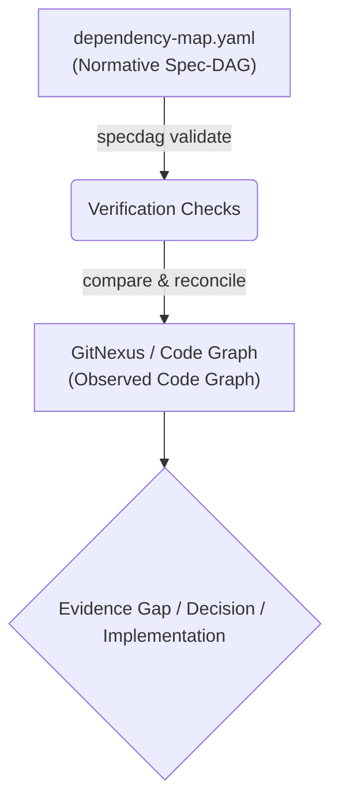

# specdag

A fast CLI and Model Context Protocol (MCP) server for validating, assembling, and analyzing dependency maps in Event-Spec-Driven Development (ESDD). Once installed, the Go binary runs fully offline.

---

## What is specdag?

`specdag` is a lightweight tool to define and validate the intended architecture of your event-driven systems using decentralized dependency maps. It acts as a normative control layer for your specifications, ensuring clean event flows, safety approvals, and verification gates before implementation.

---

## Approach: Event-Spec-Driven Development + DAGs

`specdag` is built around a clear distinction between intended behavior (normative) and observed reality (descriptive):

> **Intent and expectations** define what should be true.  
> **Events and contracts** define how systems communicate.  
> A **dependency DAG** defines what depends on what, what is blocked, and what must be verified.

This makes `specdag` a **normative control layer** for Event-Spec-Driven Development (ESDD). It does not reverse-engineer your code automatically, nor is it a runtime workflow engine. Instead, it models your **intended (desired) dependencies**, grounded in repository evidence.

### Three Layers of Truth

To avoid semantic drift and agent confusion, the ESDD workflow distinguishes between three states:

1. **Intended / Normative (What should be true):** Defined by feature intents, expectations, accepted contracts, and safety policies. This is modeled in `dependency-map.yaml`.
2. **Observed / Descriptive (What actually exists):** The current implementation, tests, log traces, and code graphs (observed via tools like **GitNexus** or `agent_run_trace`).
3. **Reconciled / Accepted (What we agree is the new truth):** Handled through `decisions.md` and durable schemas in `events/`, `contracts/`, or `domains/`.

### The Golden Rule of Spec-DAGs

> **Code may inform the Spec-DAG, but code does not automatically define the Spec-DAG.**  
> If the actual code structure and the Spec-DAG disagree, do not silently rewrite the map. Record the mismatch as an **Evidence Gap** or **Decision** so human owners can decide.

---

## Normative Spec-DAG vs Observed Code Graph

To keep features aligned, we adhere to these principles:
- **specdag** defines what should be true.
- **GitNexus** helps inspect where the code currently implements or violates it.
- **Run traces** show what happened at runtime.
- **Decisions** reconcile mismatches.

---

## How it fits with GitNexus

`specdag` defines the intended architecture, while code intelligence engines like **GitNexus** analyze the actual codebase:

```text
specdag    = Normative Spec-DAG (desired architecture, event contracts)
GitNexus   = Observed Code Graph (actual files, symbols, call chains, dependencies)
Run Trace  = Observed Runtime Trace (what happened during execution)
```

### The ESDD Workflow



1. **Define** intent, expectations, events, and contracts in specs.
2. **Model** the intended dependencies in a local `dependency-map.yaml` next to feature specs.
3. **Ground** the map with explicit code/spec references (`node.ref`).
4. **Validate** the map using `specdag validate`.
5. **Hash** the map and referenced evidence with `specdag hash`.
6. **Assemble** local maps into a global Spec-DAG when multiple features interact.
7. **Use** a code knowledge graph tool (e.g., GitNexus) to locate where the code implements or violates these dependencies.
8. **Record** any mismatch as an _Evidence Gap_ or _Decision_ rather than silently updating the spec.
9. **Implement** changes and verify with tests, `specdag verify`, refreshed code intelligence, and `specdag report`.

In short:
- `specdag` defines what **should** be true.
- `GitNexus` helps find where the code currently implements or violates it.

---

## Installation

### A) Via npm/npx (Recommended for Cursor / Claude Desktop)

You do not need to install specdag globally. You can run it directly:

```bash
npx @japorto100/specdag --help
```

Or install it globally on your system:

```bash
npm install -g @japorto100/specdag
specdag --help
```

_Note: The installed Go binary runs fully offline. The initial npm/npx installation requires network access to download the appropriate precompiled native Go binary for your operating system (Linux, macOS, Windows) and CPU architecture (amd64, arm64) from GitHub Releases._

### B) Via Go

If you have Go installed on your system:

```bash
go install github.com/japorto100/specdag@latest
```

---

## MCP Server Configuration

Add specdag to your MCP configuration file (e.g., `mcpServerConfig.json` for Cursor or Claude Desktop):

### A) Via npx (No Go installation required):

```json
{
  "mcpServers": {
    "specdag": {
      "command": "npx",
      "args": ["-y", "@japorto100/specdag", "mcp"]
    }
  }
}
```

### B) Via Go (If go install was used):

```json
{
  "mcpServers": {
    "specdag": {
      "command": "specdag",
      "args": ["mcp"]
    }
  }
}
```

---

## CLI Commands

### 1. Validate locally

Checks a local feature map file for syntactic and topological validity (cycle checking):

```bash
specdag validate specs/features/012-agent-run/dependency-map.yaml
```

Use `--strict` to enforce strict ESDD relationship rules:

```bash
specdag validate specs/features/012-agent-run/dependency-map.yaml --strict
```

### 2. Assemble globally

Recursively searches a directory for all local maps, validates them, and merges them conflict-free:

```bash
specdag assemble specs/features/ -o specs/_generated/dependency-map.global.json
```

Use `--include-graphs` to include dependency maps with `topology: graph` (they are skipped by default):

```bash
specdag assemble specs/features/ --include-graphs -o specs/_generated/dependency-map.global.json
```

Use `--format yaml` to output the assembled map in YAML format:

```bash
specdag assemble specs/features/ --format yaml -o specs/_generated/dependency-map.global.yaml
```

### 3. Render Mermaid

Generates Mermaid markdown diagram code from a map. Use `--view` to filter specific sub-views (`full`, `critical-path`, `approvals`, `events`, `verification`, `orphans`):

```bash
specdag render specs/features/012-agent-run/dependency-map.yaml --view critical-path
```

### 4. Hash Evidence

Computes a deterministic SHA-256 Merkle-DAG attestation for the dependency map and every referenced evidence file:

```bash
specdag hash specs/features/012-agent-run/dependency-map.yaml --format json
```

Verify an expected root:

```bash
specdag verify specs/features/012-agent-run/dependency-map.yaml --hash <expected-root>
```

The Merkle root proves that the reviewed map and referenced evidence did not drift. It does not replace tests, builds, GitNexus/codegraph checks, or runtime verification.

### 5. Output Summary

Calculates KPIs, approval gates, orphan nodes, and the critical path:

```bash
specdag summary specs/features/012-agent-run/dependency-map.yaml
```

### 6. Perform Impact Analysis

Finds all transitively affected downstream system components when a node ID changes:

```bash
specdag impact specs/features/012-agent-run/dependency-map.yaml event.document.uploaded
```

### 7. Generate HTML Report

Generates a static HTML review report (KPIs, tables, Mermaid diagrams, filters, gaps and warnings) for a feature map or an assembled directory:

```bash
specdag report specs/features/ -o specs/_generated/dependency-report.html
```

### 8. Run Doctor Checks

Analyzes the specifications directory structure for consistency, missing files, stale outputs, and broken references:

```bash
specdag doctor specs/
```

### 9. Cross-check Catalogs

Checks referenced events and contracts in your dependency maps against their catalog Markdown templates to ensure consistent status, IDs, and fields:

```bash
specdag check-catalogs specs/
```

---

## MCP Tools

`specdag` exposes the following tools to AI agents:

| MCP Tool | Purpose | Parameters |
|---|---|---|
| `validate_map` | Validate a local dependency map. | `filePath`, `strict` |
| `assemble_maps` | Assemble local feature maps into a generated global map. | `dirPath`, `includeGraphs`, `format` |
| `hash_map` | Compute a deterministic Merkle-DAG evidence attestation. | `filePath` |
| `verify_attestation` | Verify a dependency map against an expected Merkle root. | `filePath`, `expectedRoot` |
| `render_mermaid` | Render a Mermaid diagram from a dependency map. | `filePath`, `view` |
| `summary_map` | Summarize nodes, edges, gaps, approvals, and critical paths. | `filePath` |
| `analyze_impact` | List downstream nodes affected by a selected node. | `filePath`, `nodeId` |
| `generate_report` | Generate a static HTML review report. | `path`, `output` |
| `get_rules` | Return embedded ESDD rules and templates. | none |
| `start_feature_flow` | Start the single-feature ESDD question flow. | optional `featurePath` |
| `start_integration_flow` | Start the multi-feature integration flow. | optional `specsPath` |
| `start_reconciliation_flow` | Start the Spec-DAG vs observed-code reconciliation flow. | optional `featurePath` |
| `review_dependency_map` | Review a map for ESDD quality issues. | `filePath` |
| `migrate_feature_to_dag` | Guide migration from free-text specs/code evidence to a dependency map. | `featurePath` |

---

## Examples

You can find the following examples in the [examples/](examples/) directory:

- [bot-activation.dependency-map.yaml](examples/bot-activation.dependency-map.yaml): The main Bot Activation ESDD example (highly recommended).
- [research-import.dependency-map.yaml](examples/research-import.dependency-map.yaml): The secondary Research Document Ingestion/RAG example.
- [global.generated.example.json](examples/global.generated.example.json): An assembled global map example.
- [dependency-report.example.html](examples/dependency-report.example.html): A static HTML report artifact showing all metrics, mermaid rendering, and gap warnings.

---

## Development

### Running locally
To run the CLI tool locally:
```bash
go run main.go --help
```

### Running tests
To run the Go unit tests:
```bash
go test ./...
```

---

## License

MIT License.
